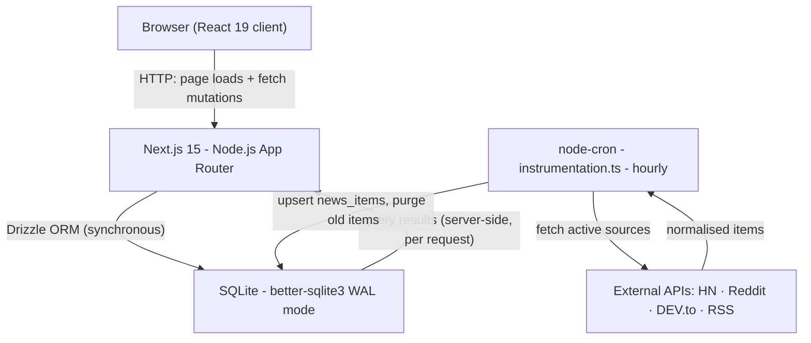
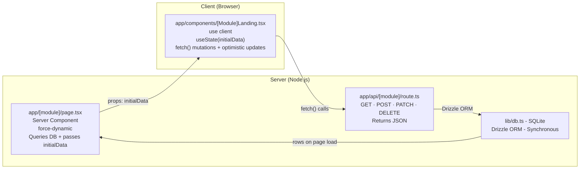
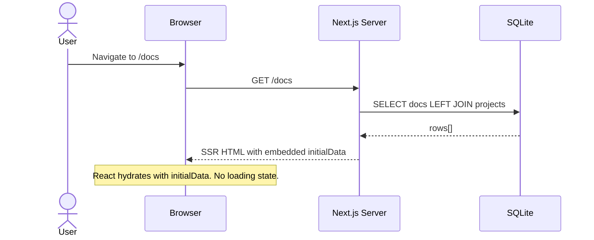
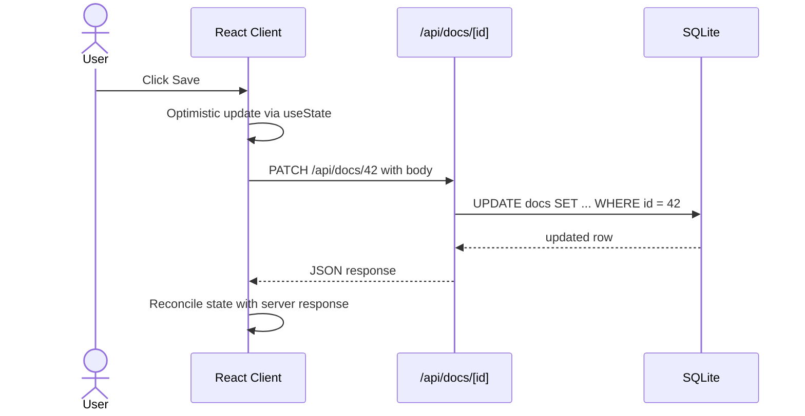
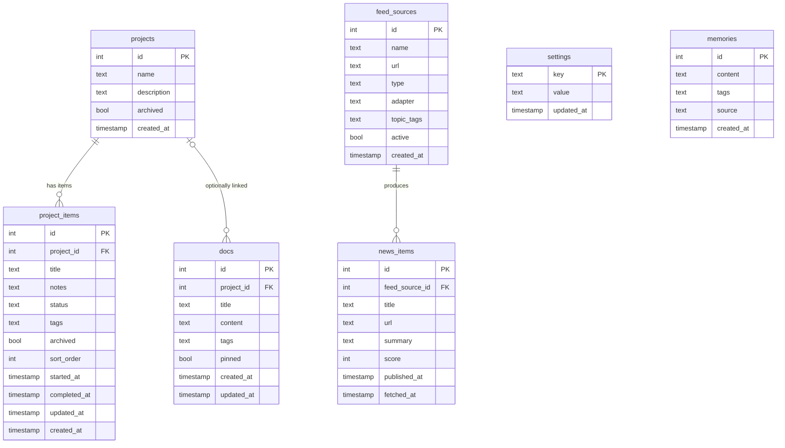
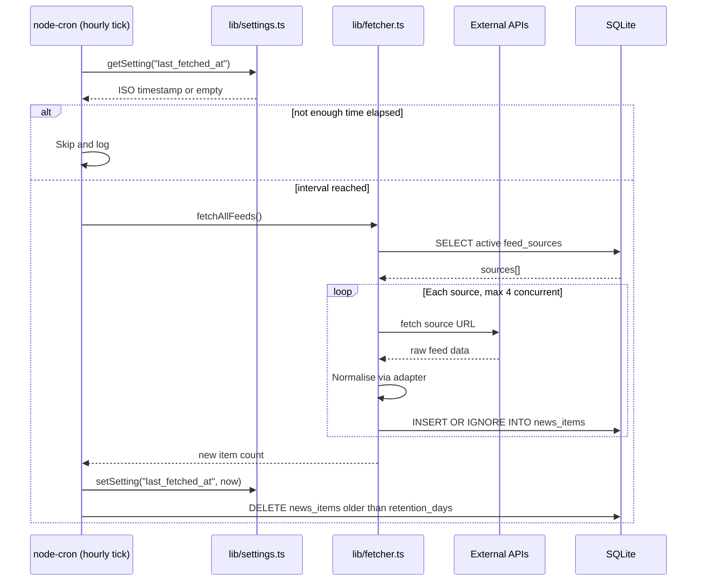
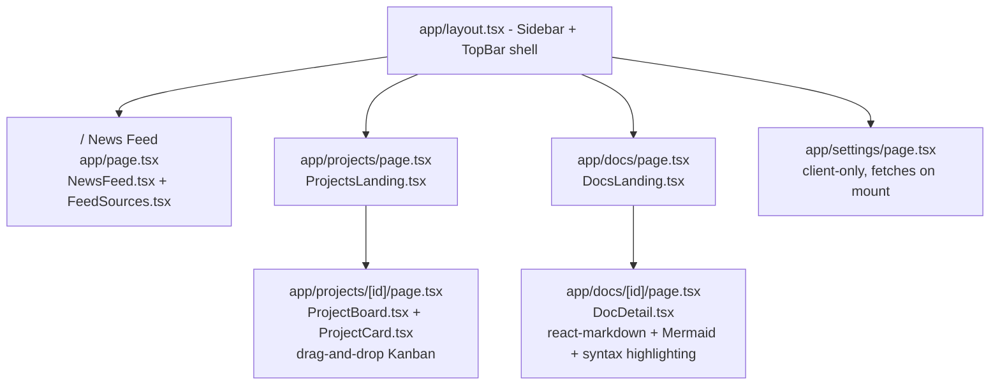

# Command Center — Architecture Overview

> High-level reference for developers exploring the codebase. Covers structure, data flow, module pattern, DB schema, and background jobs.

---

## 1. System Overview

The app is a single-user, local-only Next.js 15 dashboard. There is no auth, no cloud services, and no external state management. All persistence is SQLite on disk.

**Key properties:**
- `better-sqlite3` is **synchronous** — no async/await needed in DB calls
- `force-dynamic` on every server page — no caching, always fresh from DB
- No global client state (no Zustand, SWR, React Query)

---

## 2. Universal Module Pattern

Every module follows the same four-layer structure. Learning it once means you understand them all.

**Why this works at this scale:**
- Server page does the heavy lifting (joins, sorting) once per navigation
- Client gets pre-populated state — no loading spinner on mount
- Mutations are cheap `fetch()` calls; optimistic updates keep the UI snappy
- No hydration mismatch: server passes plain JSON, client stores it in `useState`

---

## 3. Page Load vs Mutation — Sequence Diagrams

### 3a. Page Load (e.g. navigating to /docs)

### 3b. Mutation (e.g. saving an edited doc)

---

## 4. Database Schema

**Notes:**
- `news_items.url` has a UNIQUE constraint — duplicate articles are silently ignored on upsert
- `project_items.sort_order` is managed by drag-and-drop (dnd-kit); PATCH fires on drop
- `settings` is a flat key-value store; defaults live in `lib/settings.ts → SETTING_DEFAULTS`
- `memories` table exists in schema but the module is stubbed (disabled in Sidebar)
- `project_items.status` values: idea | todo | done

---

## 5. Background Job — Feed Fetcher

**Feed adapters in `lib/fetcher.ts`:**

| Adapter | Source | Score field |
|---------|--------|-------------|
| null (RSS) | Any RSS/Atom feed | none |
| hn-algolia | Hacker News | points |
| reddit | Reddit | score |
| devto | DEV.to | positive_reactions_count |
| lobsters | Lobsters | score |

---

## 6. Routing & Component Map

---

## 7. Key Conventions at a Glance

| Convention | Detail |
|------------|--------|
| `export const dynamic = "force-dynamic"` | On every `page.tsx` — disables Next.js page caching |
| Synchronous DB | `better-sqlite3` — no `await` needed on queries |
| Optimistic updates | Client updates `useState` before `fetch()` resolves; reconciles with response |
| API errors | Always `{ error: "message" }` with appropriate HTTP status code |
| Tags | Comma-separated strings in a `text` column — split/join in the client |
| Sidebar toggle | `active: true/false` in `app/components/Sidebar.tsx → modules` array |
| New module | Run `/new-module` — scaffolds all 6 layers and updates docs automatically |
